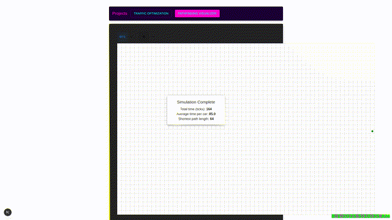
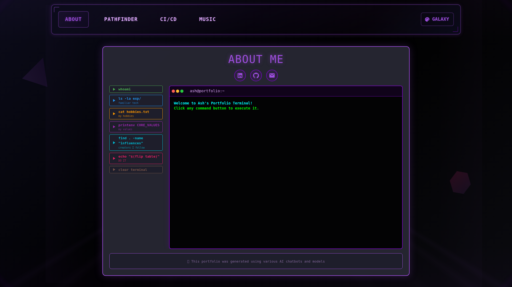
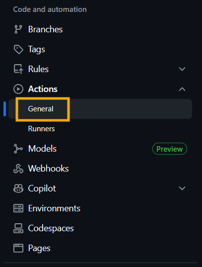
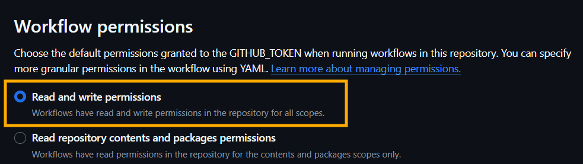

# Puppeteer GitHub Action

<div align="center" style="display:flex;justify-content:center;gap:16px;flex-wrap:wrap;">
  
  
</div>

#

<div align ="center"><a href="https://github.com/ashfordhill/ashhill.dev/blob/main/.github/workflows/puppeteer.yml">Used in this repo</a></div>

#


A GitHub Action to screenshot any URL with a timestamp.

An animated GIF can be optionally created from a series of screenshots.

## Inputs

| Name             | Required | Default        | Description                                                                |
| ---------------- | -------- | -------------- | -------------------------------------------------------------------------- |
| `url`            | Yes      | *(none)*       | The URL to screenshot.                                                     |
| `folder`         | Yes      | `timeline`     | The folder to save screenshots (and the output GIF) in.                    |
| `basename`       | Yes      | `screenshot`   | The base name for the screenshot files (e.g., `screenshot_123456.png`).    |
| `make_gif`       | No       | `false`        | Whether to generate an animated GIF from screenshots (`true` or `false`).  |
| `gif_name`       | No       | `timeline.gif` | Output GIF name (e.g., `timeline.gif`).                                    |
| `frame_duration` | No       | `1`            | How long (in seconds) each image should display in the GIF.                |
| `scale_width`    | No       | `640`          | Width of the output GIF in pixels (height auto-scales).                    |
| `auto_screenshots` | No     | `true`         | Control screenshot behavior: `true` = always take screenshots, `false` = only when most recent commit message contains `#screenshot`. |

## Setup

To allow GitHub Actions to commit files, you need to set the following permissions in your repository:




## Example Workflow

``` yaml
name: Screenshot and GIF Generator

on: [push, pull_request]

jobs:
  screenshot-and-gif:
    runs-on: ubuntu-latest
    
    steps:
      - name: Take and save visual screenshot
        uses: ashfordhill/puppeteer-action@v5
        with:
          url: http://localhost:3000
          folder: timeline
          basename: screenshot
          make_gif: true
          gif_name: timeline.gif
          frame_duration: 1
          scale_width: 640
          # Set to false if wanting action only when #screenshot in latest commit
          auto_screenshots: true  

      # 'git add -A' assumes your .gitignore is set in a way that these are the only unstaged changes. Otherwise specify the folder name used above, for 'git add'.
      - name: Commit screenshots
        run: |
          git config --global user.email "action@github.com"
          git config --global user.name "GitHub Action"
          git add -A
          git commit -m "Add/update visual screenshots [skip ci]" || echo "No changes to commit"
          git push origin HEAD:${{ github.ref }}
```

**Usage with "auto_screenshots: false"**

To trigger a screenshot with this setting, include `#screenshot` in your commit message:
```bash
git commit -m "Update homepage layout #screenshot"
```

## Future Considerations

- Multi-URL screenshots
  - Include additional URLs to visit and screenshot, in order of their listing. 
  - For the GIF creation feature, may want to store screenshots by folder per-URL to keep them in separate GIFs

- Multi-element screenshots
  - Take in configurable `n` amount of elements for Puppeteer to click on. May need delay settings as well.

- Mobile view/configurable layout view screenshots 